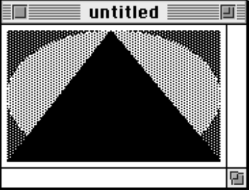
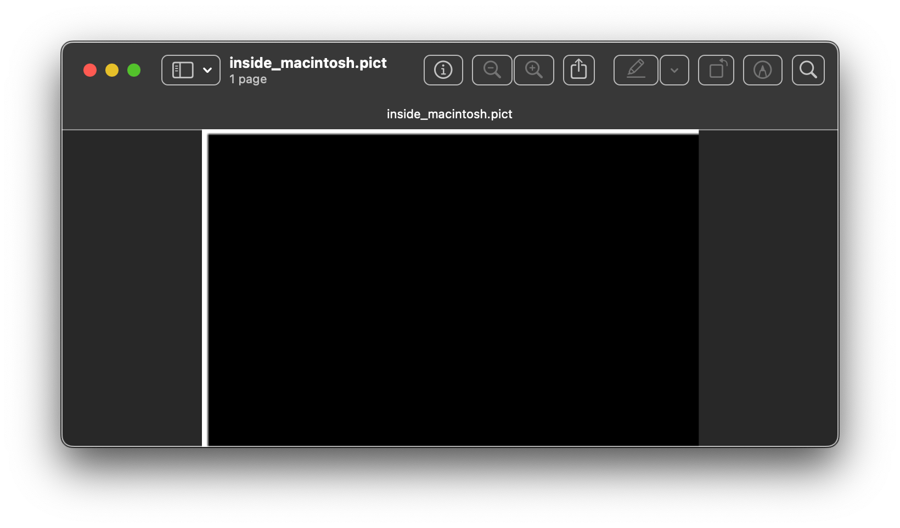

#  QuickDraw Viewer


I wanted to teach myself Swift programming, and needed something a bit more involved than just _Hello World_, so I decided the write a program that would decode QuickDraw image files and display them. This was basically a rewrite of the [Java Quickdraw](https://github.com/wiesmann/JavaQuickDraw) code I wrote, many years back.

This program is functional, although the UI is a bit rough and the code could certainly be improved. 
I originally decided to release it for the 40th anniversary of the original Macintosh computer.

## Philosophy

This program is not meant to be a pixel correct QuickDraw renderer,
instead it behaves more like a _printer driver_ did under the classic Mac OS,
and tries to render pictures as well as possible on a modern Mac OS X screen.

The screen of my 2021 14" laptop has a resolution of around 264 DPI, 
closer to the resolution of the LaserWriter printers (300DPI) than that of the screen
of a compact Macintosh (72 DPI) and well above the resolution of an ImageWriter dot matrix printer (144 DPI.)
The rendering engine of Mac OS X is also closer to a PostScript printer than the QuickDraw model.

So this program mostly translates QuickDraw instructions and delegates the actual rendering to Core Graphics.
Instructions meant for printers (QuickDraw _comments_) are also used in this translation.

## QuickDraw 

[QuickDraw](https://en.wikipedia.org/wiki/QuickDraw) was the graphical language of the original Macintosh, and the format used to store and exchange images on the computer. 
The original interpreter was written in large part in Motorola 68K
by the late [Bill Atkinson](https://en.wikipedia.org/wiki/Bill_Atkinson).
Support for these files has been slowly decaying with newer versions of Mac OS X, and on my M1 PowerBook, Preview can only open a small subset of the files I have.

## Original Pict Example

The decoder is mostly based on `Inside Macintosh - Imaging With QuickDraw` published in 1994.
The book contains the resource definition of very simple QuickDraw picture.
```
data 'PICT' (128) {
$"0078"     /* picture size; don't use this value for picture size */
$"0000 0000 006C 00A8"  /* bounding rectangle of picture at 72 dpi */
$"0011"     /* VersionOp opcode; always $0011 for extended version 2 */
$"02FF"     /* Version opcode; always $02FF for extended version 2 */
$"0C00"     /* HeaderOp opcode; always $0C00 for extended version 2 */
            /* next 24 bytes contain header information */
   $"FFFE"  /* version; always -2 for extended version 2 */
   $"0000"  /* reserved */
   $"0048 0000"         /* best horizontal resolution: 72 dpi */
   $"0048 0000"         /* best vertical resolution: 72 dpi */
   $"0002 0002 006E 00AA"  /* optimal source rectangle for 72 dpi horizontal
                              and 72 dpi vertical resolutions */
   $"0000"  /* reserved */
$"001E"     /* DefHilite opcode to use default hilite color */
$"0001"     /* Clip opcode to define clipping region for picture */
   $"000A"  /* region size */
   $"0002 0002 006E 00AA"  /* bounding rectangle for clipping region */
$"000A"     /* FillPat opcode; fill pattern specified in next 8 bytes */
   $"77DD 77DD 77DD 77DD"  /* fill pattern */
$"0034"     /* fillRect opcode; rectangle specified in next 8 bytes */
   $"0002 0002 006E 00AA"  /* rectangle to fill */
$"000A"     /* FillPat opcode; fill pattern specified in next 8 bytes */
   $"8822 8822 8822 8822"  /* fill pattern */
$"005C"
$"0008"
$"0008"
$"0071"
/* fillSameOval opcode */
/* PnMode opcode */
/* pen mode data */
/* paintPoly opcode */
   $"001A"  /* size of polygon */
   $"0002 0002 006E 00AA"  /* bounding rectangle for polygon */
   $"006E 0002 0002 0054 006E 00AA 006E 0002"   /* polygon points */
$"00FF"     /* OpEndPic opcode; end of picture */
}; 
```

You can [download the compiled Pict file](docs/inside_macintosh.pict).
the rendering in the book looks like this:



This is how the Picture is rendered in Preview Version 11.0 on Mac OS X 14.4 (Sonoma).



This is how it is rendered in QuickDraw Viewer:


## Supported File types

This application basically handles QuickDraw image files, but also two related (but distinct) image formats:

* QuickTime images (`QTIF`) 
* MacPaint images (`PNTG`)

These two formats are handled by converting them into QuickDraw at load time.
QuickTime images are supported so far as the underlying codec is supported.
MacPaint images are just converted into a bitmap. Technically they are supported because it is one possible QuickTime codec for an image, although I have yet to encouter such an image in the wild.

## Structure

This program has basically four parts:

* A library that parses QuickDraw files, which only depends on the `Foundation` framework.
* A Library that renders into a CoreGraphics context, which depends on CoreGraphics, CoreText and CoreImage (AppKit is pulled in for some color logic, but could easily be removed).
* A library that uses [Core Video to decode QuickTime embedded images](https://wiesmann.codiferes.net/wordpress/archives/41172) that use video codecs into RGB.
* A minimalistic Swift-UI application that shows the pictures. 

This architecture is meant to allow the code to be used in other applications that want to handle QuickDraw files.

## Features

The library basically parses QuickDraw version 1 and version 2 files and supports the following primitives:

* Lines
* Basic Shapes
  * Rectangles
  * Ovals
  * Round-Rectangles
  * Arcs 
* Regions
* Text, with the following features:
  * Size, font and style selection.
  * Rotation 
* Patterns
  * original 8×8 1 bit patterns
  * colour patterns of arbitrary size.
* Color selection:
  * Quickdraw 1 (color planes) 
  * Quickdraw 2 RGB
  * Proprietary (Canvas) CMYK
* Palette images
* Direct (RGB) images
* QuickTime embedded images with the following codecs:
  * External image formats: JPEG, TIFF, PNG, BMP, JPEG-2000, GIF, SGI 
    – rendering is delegated to Core Graphics 
  * RAW (`raw `) – Decoded to RGB
  * MacPaint – Decoded to BitMap 
  * Targa (`tga `) for RLE 8-bit palette, RLE 24-bit RGB, RLE 8-bit grayscale.
  * Apple Video (`RPZA`) – Decoded to 555 RGB 
  * Apple Component Video (`YUV2`) – Decoded to RGB 
  * Apple Graphics (`smc `) – Decoded to palette. 
  * Apple Animation (`RLE `) with depths of 2,4,8,16, 24 and 32 bits/pixel
  * Planar Video (`8BPS`) – Decoded to RGB 
  * Intel Raw (`YVU9`) – Decoded to RGB 
  * Cinepak (`CVID`) – Decoded to palette or RGB 
  * Digital Video variants (`dvc `, `dvcp`, `dv5n`, `dvpp`, `dv5p`) - Decoded to RGB Using Core Video
  * `h263` – Decoded to RGB using Core Video.

Some basic comment parsing is used to improve images, in particular:

* Polygon annotations to [connect the lines](https://wiesmann.codiferes.net/wordpress/archives/37337) and closed polygons
* Fractional pen width
* [Text rotation](https://wiesmann.codiferes.net/wordpress/archives/37285)
* [ICC Color profiles](https://wiesmann.codiferes.net/wordpress/archives/41085)
* CMYK colors embedded in proprietary Deneba / Canvas comments.

## Unsupported features

Currently, the following QuickDraw features don't work:

* Some exotic compositing modes (which are typically not supported by printers)
* Text alignement
* Polygon smoothing
* Exotic QuickTime codecs, like for instance [Photo-CD](https://en.wikipedia.org/wiki/Photo_CD) or Sorenson.

## User Interface Application

The application is currently very simple, you can view pictures, copy-paste them to Preview. 
There is an export icon in the toolbar that allows you to export to PDF files. 
There is some primitive drag-drop that as of Mac OS X 15.5 seems to work with most targets I could test with. 

## Helper script

I wrote a small [Python script](QuickDrawViewer/pict_de_rez.py) for converting the QuickDraw data in a text resource description into  actual PICT files.
This can be useful for [recovering data from clipping or from applications](https://wiesmann.codiferes.net/wordpress/archives/41107). 


## License 

The code is distributed under the [Apache 2.0 License](License.txt).
