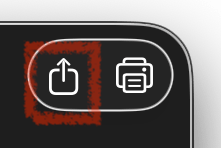

# FAQ

## User Interface

### How can I export a picture?

There is an export button on the right side of the window, 
clicking on it will show the file export dialog box. 

You can also drag drop the content of the window to the desktop or another application, or copy paste it into Preview.

## Rendering

### Is the rendering pixel accurate?

Generally, no. Vector drawing instructions are translated into Core Graphics instructions, which will result in different pixel rendering, in particular when you consider that modern Mac computers have much higher resolution. Pixmap rendering _should_ be accurate.

### How can I get pixel accurate rendering?

Your best bet for getting pixel correct rendering is to run a Mac emulator, like for instance the excellent [Infinite Mac](https://infinitemac.org), upload your file and convert it there, either in a modern bitmap format like PNG, or EPS, maybe by printing to an emulated printer. 

## QuickTime Images

### Could you export the embedded image files?

If the QuickTime container holds a single image in a format that is supported externally, like JPEG or TIFF, it would sense to export that content (extraction) and avoid all the possibly lossy conversions.

This is a feature I'm looking into implementing.

### Can you support codec `WXYZ`? 

Possibly. Generally, for me to add support for a Codec, I need some samples, and ideally some form of documentation or a pointer to some other code that supports said codec (say FFMPEG). 

## SVG 

### Can the program export SVG?

No.

### Is SVG support planed? 

Not at this time. My primary goal was making a simple program that would do three things:

* Allow me hack around quickly with minimal back-end work.
* Display the pictures in the application.
* Exporting them in formats that are useful on a modern Mac.

SVG fullfill none of these goals. 

If you feel like implementing it, you are most welcome, I tried to structure the code in a way that makes this possible, as the parser is separated from the renderer.

SVG is a format, not an API, so this would involve either using a framework to generate the SVG, or write that logic directly. 

The rendering back-end would need to have additional logic, as SVG has only embed limited Bitmap formats (PNG and JPG), so while vector instructions could be dispatched directly, pixmap (including patterns) would need to be rendered and exported as PNG data.

If you want generate a single file, and not a bunch of scattered resources, the PNG need to be encoded using the `data` protocol, which basically stores the Base-64 version inside the SVG. PICT files are by no mean space-efficient, but this would really make large files. 

Some features like ICC colour profiles are _theoretically_ supported, but browswer support is limited.

## Linux

### Can the program be compiled for Linux?

No. Even though the Swift language is cross-platform, QuickDraw viewer relies on many frameworks like CoreGraphics, CoreText and CoreImage for back-end rendering. The parser probably compiles fine of most platforms, but the renderer won't. 

There is an open-source project to implement a [CoreGraphics alternative](https://github.com/OpenSwiftUIProject/OpenCoreGraphics), but that is only one component, as you would also need an equivalent to CoreText and CoreImage to get any basic rendering working. 

A more reasonable solution for Linux would probably be to build an SVG renderer and make a command-line tool. Actual rendering can be done using another program, for instance a web-browser.

